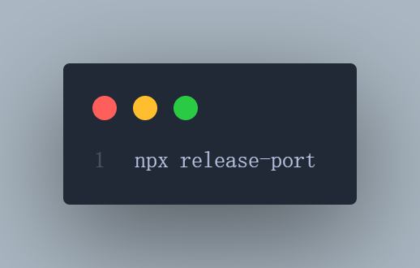

<div align="center">
  
</div>
<h1 align="center">release-port</h1>
<div align="center">
  <strong>Kill process running on given port</strong>
</div>
<br>
<div align="center">
  <a href="https://npmjs.org/package/release-port">
    
  </a>
  <a href="https://npmjs.org/package/release-port">
    
  </a>
  <a href="http://makeapullrequest.com">
    
  </a>
</div>
<br>

> **Note**:
> Forked from [`kill-port`](https://www.npmjs.com/package/kill-port)

## Changes in this fork

- no dependencies
- add sync function to kill port
- typescript
- viteset

## Usage

```js
const http = require('node:http')
const { release, releaseSync } = require('release-port')
const port = 8080

const server = http.createServer((req, res) => {
  res.writeHead(200, {
    'Content-Type': 'text/plain'
  })

  res.end('Hi!')
})

server.listen(port, () => {
  setTimeout(() => {
    // Currently you can kill ports running on TCP or UDP protocols
    release(port, 'tcp')
      .then(console.log)
      .catch(console.log)

    // or sync function
    const { out, err, error } = releaseSync(port, 'tcp')
  }, 1000)
})
```

## API

### release, releaseSync

```js
release(port, method)
releaseSync(port, method)
```

releaseSync is release's sync function.

#### Options

##### port

- Required: `true`
- Type: `string | number`

process port

##### method

- Required: `false`
- Type: `'udp' | 'tcp'`
- Default: `'tcp'`

process type

### execa, execaSync

```js
execa(command)
execaSync(command)
```

#### Options

##### command

- Required: `true`
- Type: `string`

command to execute in shell.

## CLI

You can use `release-port` as a global package.

Install the package globally:

```sh
$ npm install --global release-port
# OR
$ yarn global add release-port
```

Then:

```sh
$ release-port --port 8080
# OR
$ release-port 9000
# OR you can use UDP
$ release-port 9000 --method udp
```

You can also kill multiple ports:

```sh
$ release-port --port 8080,5000,3000
# OR
$ release-port 9000 3000 5000
```

You can also use [npx](https://nodejs.dev/learn/the-npx-nodejs-package-runner) to `release-port` without installing:

```sh
# Kill a single port
$ npx release-port --port 8080
$ npx release-port 8080
# Use UDP
$ npx release-port 9000 --method udp
# Kill multiple ports
$ npx release-port --port 8080,5000,3000
$ npx release-port 9000 3000 5000
```

## License

[MIT](./LICENSE) License © 2023-PRESENT [dmZhan](https://github.com/dmZhan)
